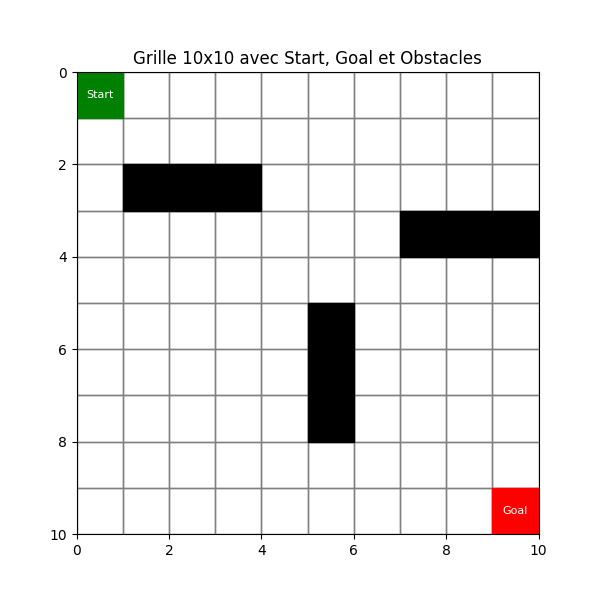
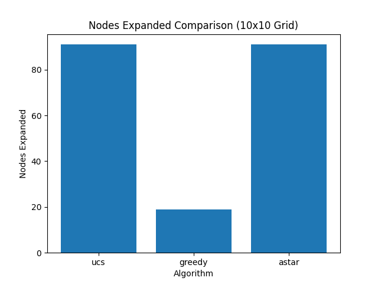
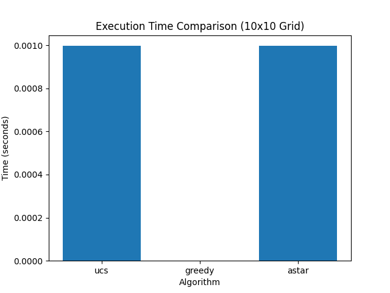
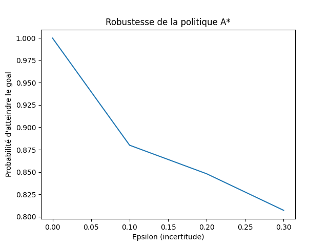
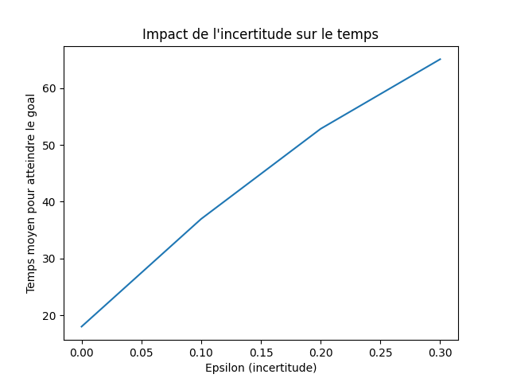

# Planification robuste dans une grille : A* et modélisation de Markov

## Présentation du projet

Ce projet étudie le **problème de planification de chemin pour un agent autonome dans une grille contenant des obstacles**, en combinant des méthodes de **recherche déterministes** et une **modélisation probabiliste**.

L’objectif est de calculer un chemin optimal à l’aide de l’algorithme **A***, puis d’analyser l’impact de **l’incertitude dans les déplacements de l’agent** sur la probabilité d’atteindre l’objectif.

Le projet combine :

* des **algorithmes de recherche classiques** (UCS, Greedy, A*)
* des **fonctions heuristiques**
* des **chaînes de Markov** pour modéliser l’incertitude
* des **simulations Monte-Carlo** pour évaluer la robustesse du chemin

Ce projet a été réalisé dans le cadre du module **Bases de l’Intelligence Artificielle**.

---

## Modélisation de l’environnement

L’environnement est représenté sous forme d’une **grille 2D** :

* chaque cellule correspond à un **état**
* certaines cellules contiennent des **obstacles**
* l’agent peut se déplacer dans **quatre directions**

Actions possibles :

* Haut
* Bas
* Gauche
* Droite

Chaque déplacement possède un **coût unitaire**.

Exemple de grille :



---

## Algorithmes de recherche implémentés

Le projet compare trois stratégies de recherche.

### 1. Uniform Cost Search (UCS)

* sélectionne le nœud avec le **plus faible coût accumulé**
* garantit un chemin **optimal**
* explore généralement **beaucoup de nœuds**

---

### 2. Greedy Best-First Search

* utilise uniquement la **fonction heuristique**
* plus rapide
* ne garantit pas toujours l’optimalité

---

### 3. Algorithme A*

A* combine le coût réel du chemin et une estimation heuristique :

f(n) = g(n) + h(n)

où :

* **g(n)** : coût du chemin depuis l’état initial
* **h(n)** : estimation du coût restant jusqu’à l’objectif

Dans ce projet, l’heuristique utilisée est la **distance de Manhattan** :

h(x,y) = |x - x_goal| + |y - y_goal|

---

## Modélisation de l’incertitude avec les chaînes de Markov

Pour représenter l’incertitude dans les déplacements, nous utilisons une **chaîne de Markov**.

Lorsqu’un agent tente d’exécuter une action :

* avec une probabilité **1 − ε**, l’action réussit
* avec une probabilité **ε**, l’agent peut :

  * dévier vers une cellule latérale
  * rester dans la même position

Le comportement de l’agent est décrit par une **matrice de transition**.

L’évolution de la distribution de probabilité est donnée par :

π(n) = π(0) Pⁿ

où :

* **π(0)** est la distribution initiale
* **P** est la matrice de transition

---

## Simulation Monte-Carlo

Afin d’évaluer la robustesse du chemin calculé par A*, nous réalisons des **simulations Monte-Carlo**.

Pour différentes valeurs de **ε** :

* plusieurs trajectoires sont simulées
* la **probabilité d’atteindre l’objectif** est estimée
* le **temps moyen pour atteindre l’objectif** est calculé

---

## Résultats expérimentaux

### Comparaison du nombre de nœuds explorés



---

### Comparaison du temps d’exécution



---

### Probabilité d’atteindre l’objectif



---

### Temps moyen pour atteindre l’objectif



---

## Structure du projet

```
.
├── main.py
├── README.md
├── requirements.txt
│
├── figures
│   ├── grid_initial.png
│   ├── markov_probability.png
│   ├── markov_time.png
│   ├── nodes_comparison.png
│   └── time_comparison.png
│
└── src
    ├── astar.py
    ├── experiments.py
    ├── grid.py
    ├── heuristics.py
    ├── markov.py
    ├── plot_grid.py
    └── simulation.py
```

### Description des modules

**grid.py**
Définit l’environnement sous forme de grille et gère les obstacles.

**heuristics.py**
Implémente les fonctions heuristiques utilisées par les algorithmes de recherche.

**astar.py**
Implémente les algorithmes UCS, Greedy et A*.

**markov.py**
Construit la matrice de transition et modélise les déplacements stochastiques.

**simulation.py**
Réalise les simulations Monte-Carlo.

**experiments.py**
Exécute les expériences et collecte les résultats.

**plot_grid.py**
Génère les visualisations et les graphiques.

**main.py**
Script principal permettant d’exécuter l’ensemble du projet.

---

## Installation

Cloner le dépôt :

```
git clone https://github.com/houda-eljirari/robust-grid-planning-Astar-Markov.git
cd robust-grid-planning-Astar-Markov
```

Installer les dépendances :

```
pip install -r requirements.txt
```

---

## Exécution du projet

Lancer le programme principal :

```
python main.py
```

Ce script permet :

1. de générer la grille
2. de calculer les chemins avec UCS, Greedy et A*
3. d’exécuter les simulations de Markov
4. de produire les graphiques de résultats

---

## Observations principales

* **A*** explore moins de nœuds que UCS tout en garantissant l’optimalité.
* **Greedy** est plus rapide mais peut produire des chemins sous-optimaux.
* Lorsque **l’incertitude ε augmente**, la probabilité d’atteindre l’objectif diminue.
* L’incertitude augmente également le **temps moyen nécessaire pour atteindre l’objectif**.

---

